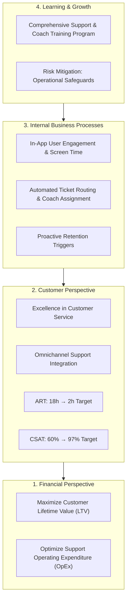

# Mobile Fitness Coaching App — Strategic Balanced Scorecard & Operations Analytics

[](https://python.org)
[](https://www.bscdesigner.com)
[](analytics/)
[](analytics/test_tracker.py)
[](LICENSE)

A comprehensive operations management, business intelligence, and **Balanced Scorecard (BSC)** performance analysis for a digital **Mobile Fitness Coaching Platform**. Authored by **Younss Yahya**, this project models strategic alignment across customer success, internal digital processes, support responsiveness, and operational risk mitigation over an 11-month observation period (January 2025 – November 2025).

Includes a dedicated **Python Analytics Engine** (`analytics/kpi_tracker.py`) with structured JSON datasets and unit test verification.

---

## 🎯 Executive Overview

Modern mobile fitness applications require harmonizing digital user experience, operational support velocity, and customer retention. Using the **Balanced Scorecard framework (BSC Designer)**, this initiative tracked multi-dimensional metrics to transition customer operations from high latency to real-time omnichannel resolution.

### Key Milestones Achieved:
- **Average Response Time (ART)** reduced by **86.1%**, falling from an initial baseline of **18.0 hours** down to **2.5 hours** (peaking at **2.0 hours** in October 2025, reaching **100% of target**).
- **Customer Satisfaction (CSAT)** increased from **60%** to a peak of **94%** following the rollout of direct omnichannel customer support.
- **First Contact Resolution (FCR)** rose from **43%** to a high of **78%** as specialized coaching triage workflows were introduced.

---

## 🗺️ Strategic Strategy Map



---

## 📊 Core Performance Metrics & Monthly Dynamics

The analysis models continuous monthly tracking across 11 calendar periods:

### 1. Customer Perspective KPIs
| Month | Average Response Time (hrs) | ART Progress | First Contact Resolution (%) | FCR Progress | Customer Satisfaction (CSAT) | CSAT Progress |
| :--- | :---: | :---: | :---: | :---: | :---: | :---: |
| **Jan 2025** | 18.0 hrs | 0.00% | 43.0% | -17.50% | 60.0% | 0.00% |
| **Feb 2025** | 10.0 hrs | 50.00% | 58.0% | +20.00% | 65.0% | +13.51% |
| **Mar 2025** | 12.0 hrs | 37.50% | 62.0% | +30.00% | 59.0% | -2.70% |
| **Apr 2025** | 3.0 hrs | 93.75% | 73.0% | +57.50% | 86.0% | +70.27% |
| **May 2025** | 3.2 hrs | 92.50% | 70.0% | +50.00% | 94.0% | +91.89% |
| **Jun 2025** | 4.0 hrs | 87.50% | 65.0% | +37.50% | 87.0% | +72.97% |
| **Jul 2025** | 5.0 hrs | 81.25% | 78.0% | +70.00% | 82.0% | +59.46% |
| **Aug 2025** | 3.2 hrs | 92.50% | 75.0% | +62.50% | 90.0% | +81.08% |
| **Sep 2025** | 3.0 hrs | 93.75% | 74.0% | +60.00% | 93.0% | +89.19% |
| **Oct 2025** | 2.0 hrs | **100.00%** | 72.0% | +55.00% | 78.0% | +48.65% |
| **Nov 2025** | 2.5 hrs | 96.88% | 68.0% | +45.00% | 84.0% | +64.86% |

---

## 🛠️ Risk Management & Mitigation

During the rollout of rapid response protocols, operational risks were identified regarding coaching workload saturation and burnout:
1. **Identified Risk**: `[Risk] Impact on operations` — Rapid response SLA pressure causing support team churn.
2. **Mitigation Initiative**: Rollout of a structured **Comprehensive Training Program** combined with asynchronous ticketing triage to buffer real-time coach demands.

---

## 💻 Python Analytics Engine

The repository provides automated tools to inspect and calculate Balanced Scorecard indicators:

```
coaching/
├── analytics/
│   ├── kpi_data.json       # Structured 11-month historical dataset
│   ├── kpi_tracker.py      # CLI dashboard and statistical aggregator
│   └── test_tracker.py     # Unittest suite verifying calculation logic
├── report.pdf              # Full compiled executive Balanced Scorecard document
└── README.md
```

### Running the Analytics CLI
```bash
python analytics/kpi_tracker.py
```

### Running the Test Suite
```bash
python -m unittest discover -s analytics
```

---

## 👤 Author
**Younss Yahya**  
- GitHub: [@youunss](https://github.com/youunss)  
- Degree: Computer Science, Misr International University (MIU)  
- Specialization: Cybersecurity, Cloud Systems, and Business Intelligence